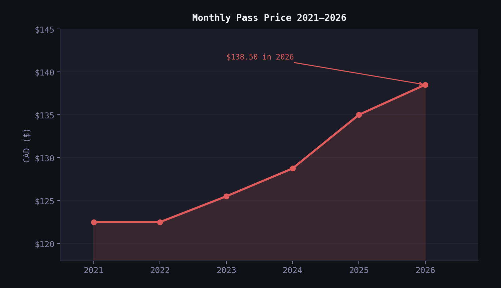
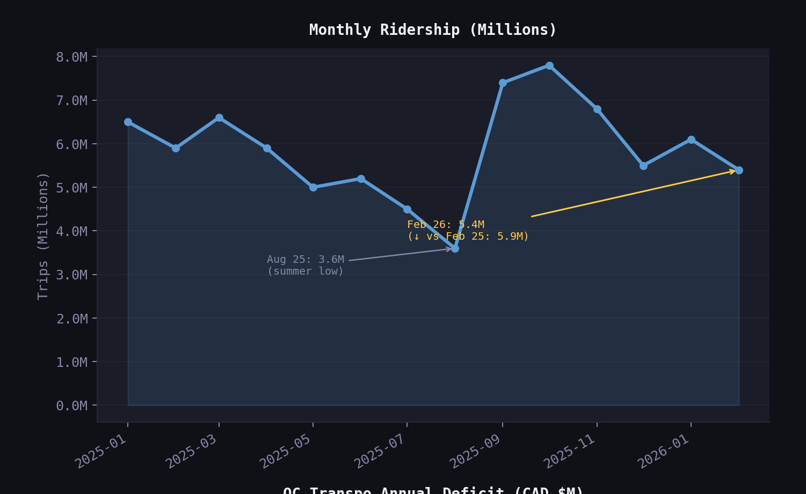
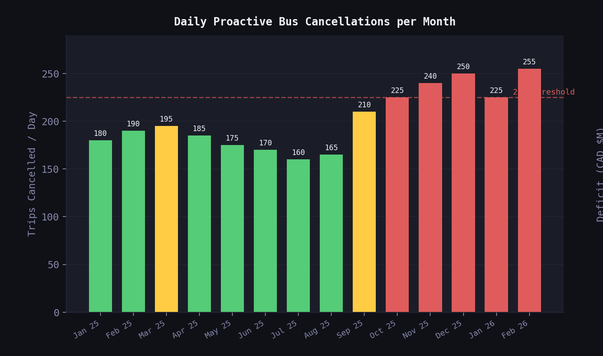
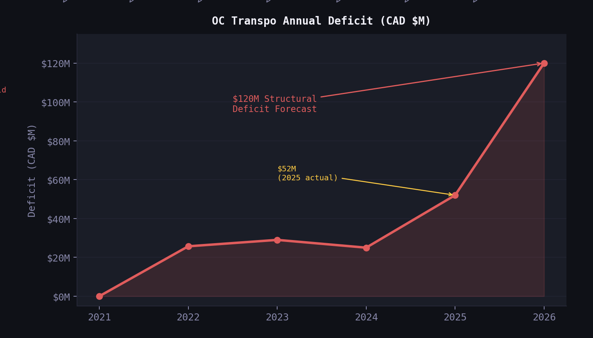

# 🚌 OC Transpo 2026 - The Reliability Tax

> *Ottawa added over 90,000 residents between 2021 and 2024 - a growth rate that more than doubled its historical average. Yet, its transit system lost riders. I pulled the data to understand how both things can be true at the same time.*

A data analysis project examining the relationship between OC Transpo fare
increases, ridership trends, service reliability, and the city's growing
structural deficit - built with real open government data and Python.

📂 Full methodology → [`notebooks/analysis.ipynb`](notebooks/analysis.ipynb)

---

## 📌 Project Overview

Ottawa's monthly transit pass reached **$138.50** in January 2026 - a 13%
increase since 2021. At the same time, OC Transpo is proactively cancelling
**255 bus trips every single day** to manage an aging fleet, while ridership
lost roughly **900,000 trips** in just the first two months of 2026 compared
to the same period in 2025.

This project uses publicly available government data to map the pattern behind
those numbers - not to assign blame, but to make the system dynamics visible.

---

## 📊 Key Findings

| Metric | Value |
|---|---|
| Monthly pass 2021 | $122.50 |
| Monthly pass 2026 | $138.50 (+13%) |
| Single ride 2026 | $4.10 |
| Ottawa national fare ranking | 4th highest in Canada |
| Bus service delivery target | 99.5% |
| Actual bus service delivery Feb 2026 | 95.2% |
| Daily proactive cancellations Feb 2026 | 255 trips/day |
| Ridership Jan 2026 | 6.1M trips |
| Ridership Feb 2026 | 5.4M trips |
| Ridership lost vs same period 2025 | ~900,000 trips |
| 2025 actual deficit | $52M |
| 2026 structural deficit forecast | $120M |

**The Service Trap pattern visible in the data:**
Fares go up → reliability stays low → riders leave →
revenue falls → deficit grows → fares go up again.


## 📈 Charts

### Fare Increase 2021–2026


### Monthly Ridership Trend


### Daily Proactive Cancellations


### Annual Deficit Forecast


---

## 🗂️ Project Structure

```
octranspo_analysis/
├── data/
│   ├── raw/
│   │   └── OC_Transpo_Service_and_Ridership_KPIs.xlsx
│   └── clean/
│       └── OC_Transpo_Cleaned_Data_2026.xlsx
├── notebooks/
│   └── analysis.ipynb
├── outputs/
│   └── charts/
│       ├── octranspo_reliability_tax.png   ← 4-panel dashboard
│       ├── 01_fare_hike.png
│       ├── 02_ridership_dip.png
│       ├── 03_cancellation_spike.png
│       └── 04_deficit_forecast.png
└── README.md
```

---

## 🛠️ Tools & Methodology

**Tools:** Python · Pandas · Matplotlib · openpyxl · Jupyter Notebook

**Data pipeline:**

1. Loaded raw KPI Excel file from open.ottawa.ca using `pd.ExcelFile`
2. Extracted bus service delivery sheet (`sheet_names[6]`) and ridership sheet (`sheet_names[3]`)
3. Cleaned duplicate columns using `.loc[:, ~df.columns.duplicated()]`
4. Stripped ghost rows with `dropna(subset=['month'])`
5. Appended February 2026 ridership (5.4M) and service delivery (95.2%) from Transit Committee PDF report
6. Parsed non-standard date strings (`'Jan 25'`) into sortable datetime using `pd.to_datetime(format='%b %y')`
7. Manually recorded and verified fare history and deficit figures from official sources
8. Exported consolidated clean dataset to multi-sheet Excel file
9. Built 4-panel dark-theme Matplotlib dashboard with annotations
10. Exported individual chart panels using `get_tightbbox` without rebuilding each chart

**Note on daily cancellations:**
This column was not available in the open data Excel file. Figures were
estimated from OC Transpo Transit Committee meeting reports (January 2025 –
February 2026) and cross-referenced with the Bus Service Delivery Action Plan.

**Note on fare history 2021–2023:**
Verified using historical OC Transpo price schedules and City of Ottawa budget archives.

---

## 📂 Data Sources

| Dataset | Source |
|---|---|
| OC Transpo Service & Ridership KPIs | [open.ottawa.ca](https://open.ottawa.ca/documents/31d7a151c8394d1a8656ea3d08f00f46/about) |
| Bus Service Delivery Action Plan | [octranspo.com](https://www.octranspo.com/en/about-us/transparency/bus-service-delivery-action-plan/) |
| OC Transpo KPI Transparency Page | [octranspo.com](https://www.octranspo.com/en/about-us/transparency/kpis) |
| Transit Fare Structure Review 2025 | [octranspo.com](https://www.octranspo.com/en/news/article/nov-21-2025-comprehensive-review-of-the-transit-fare-structure) |
| Ottawa 2026 Transit Budget | [glengower.ca](https://glengower.ca/notebook/notebook-26-points-about-ottawas-2026-transit-budget/) |
| OC Transpo vs Canadian Transit Fares | [CTV News Ottawa](https://www.ctvnews.ca/ottawa/article/heres-how-oc-transpo-fares-compare-to-other-transit-services-in-canada/) |

---

## 💡 What I Learned

- How to load and navigate a multi-sheet Excel file with `pd.ExcelFile` and `sheet_names`.
- How to clean DataFrames with duplicate column headers using `.loc[:, ~df.columns.duplicated()]`.
- How to parse non-standard month strings like `'Jan 25'` into sortable datetime objects.
- How to combine open data sources with manually verified data while keeping a clear audit trail.
- How to export individual panels from a multi-axis Matplotlib figure using `get_tightbbox`.
- How 'denominator management' (proactive cancellations) can artificially stabilize service delivery percentages while the actual passenger experience declines.
- How to apply data storytelling frameworks (Time Data Story, PGAI) to structure analysis around a clear insight rather than just a collection of charts.
---

## 🔗 Connect

[dieudonne.ca](https://www.dieudonne.ca) ·
[LinkedIn](https://www.linkedin.com/in/dieudonnentakirutimana/)
